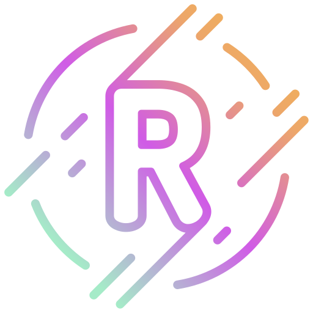

#  Rehman Saleem - Portfolio 💻✨

<div align="center">
  
  
 
</div>

## 👋 Welcome to My Digital Space!

> **AI-Powered Web Developer | Chatbot Automation Specialist | Creative Problem Solver**

I build cutting-edge web solutions that combine responsive design with intelligent AI capabilities. With expertise in frontend development, Shopify customization, and interactive animations, I create digital experiences that make a difference.

---

## 🚀 Key Skills & Expertise

| Category | Technologies | Proficiency |
|---------|-------------|-------------|
| **Frontend** | React, Next.js, JavaScript, TypeScript | ⭐⭐⭐⭐⭐ |
| **Backend** | Node.js, Python, FastAPI | ⭐⭐⭐⭐⭐ |
| **AI & Automation** | Chatbots, AI Integration, NLP | ⭐⭐⭐⭐☆ |
| **Design** | UI/UX, Prototyping, Responsive Design | ⭐⭐⭐⭐☆ |
| **Databases** | API Management, Database Design | ⭐⭐⭐⭐☆ |

### 🛠 Technical Skills Visualization

```
JavaScript/TypeScript    █████████░  90%
React/Next.js            ██████████  92%
AI Integration           ████████░░  88%
UI/UX Design             ████████░░  85%
API & Databases          ███████░░░  80%
```

### 💡 Soft Skills

```
Teamwork     █████████░  90%
Creativity   ██████████  95%
Empathy      █████████░  92%
Communication████████░░  85%
```

---

## 🎯 Why Choose Me?

### ⚡ AI-Powered Web Development
Combine responsive website aesthetics with AI-driven code generation and optimization.

### 🤖 Chatbot Automation
Deploy automated conversational AI chatbots that understand and respond to user needs.

---

## 🌟 Featured Solutions

| Solution | Features |
|---------|----------|
| **E-Commerce AI** | Product recommendations, automated descriptions, AI support, personalized marketing |
| **SaaS Platforms** | Custom AI integrations, predictive analytics, automated reporting, API support |
| **Enterprise Solutions** | Business tools, process automation, data-driven decisions, ML models |

---

## 📁 Projects Showcase

### 🛍️ E-Commerce Transformation
> Increased online sales by 40% with AI-powered product recommendations and chatbot support.

### 🧠 Intelligent CRM System
> Automated 70% of customer service interactions with agent-like AI assistants.

### 🗄️ Database Optimization
> Reduced query time by 65% using AI-driven database restructuring and caching strategies.

---

## 📞 Get In Touch

### 📍 Location
Pakistan

### 📧 Email
[rehmansaleem6530089@gmail.com](mailto:rehmansaleem6530089@gmail.com)

### 📱 Phone
0322-6530089

### ⏰ Business Hours
Mon - Fri, 9:00 AM - 6:00 PM

### 🌐 Social Links
[](#) 
[](#) 
[](#) 
[](#)

---

## 🎨 Technologies & Tools

`NextAuth.js` `Node.js` `UI/UX` `React` `Next.js` `FastAPI` `Supabase` `NextAuth`

---

## 📈 GitHub Stats


---

## 📬 Contact Form

Want to discuss a project or just say hello? Fill out the form on my [portfolio website](index.html) or reach out directly!

---

*Made with ❤️ and 💻 by Rehman Saleem*
